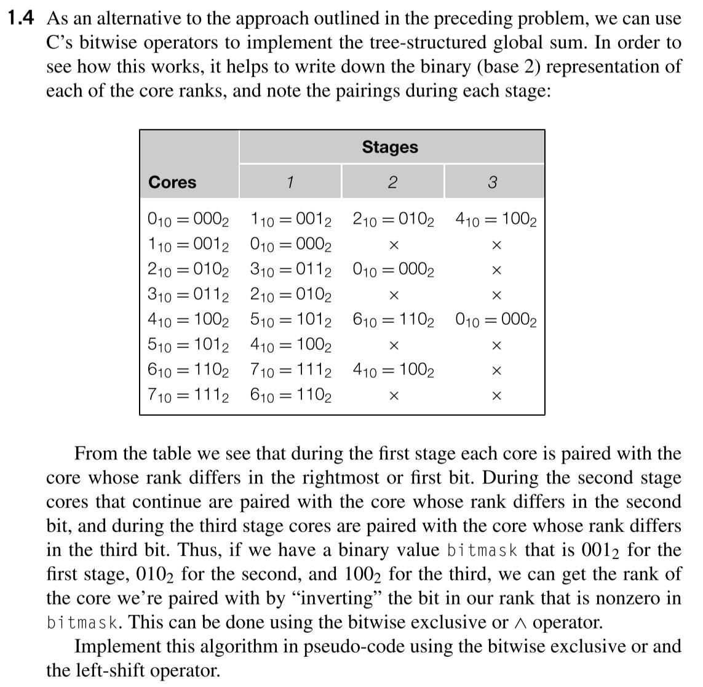
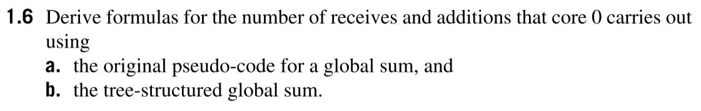
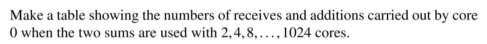

# Homework of Chapter 1

## Exercise 1.4

### Problem



### Answer

___Pseudo Code___

```c
int bitmask = 1;
int total_cores = bin(111);
int my_rank;
int my_value;

while (bitmask < total_cores){
    int partener = my_rank ^ bitmask;
    if (my_rank % bitmask != 0){
        send(my_value,  partener);
        return;
    }
    my_value += receive(partener);
    bitmask << 1;
}
```

## Exercise 1.6

### Problem





### Answer

Suppose we have p processors.

If we use the original global sum, it's obviously that the core 0 will receive values sent by each core. So core 0 will receive p - 1 and operate p - 1 times additions.

And if we use tree structure, other cores will do the same things as core 0 at the same time. Let's consider a structure of a perfect binary tree with p child node at the last layer. The number of layer of this tree represents the times that core 0 will operate. So core 0 will receive only $\log_{2}{p}$ and operate $\log_{2}{p}$ times additions.

So we can conclude a table below:

| Type           | Num of Receives | Num of Additions |
| -------------- | --------------- | ---------------- |
| Original       | p - 1           | p - 1            |
| Tree Structure | $\log_{2}{p}$   | $\log_{2}{p}$    |


| Original | Num of Receives | Num of Additions |
| -------- | --------------- | ---------------- |
| 2        | 1               | 1                |
| 4        | 3               | 3                |
| 8        | 7               | 7                |
| 16       | 15              | 15               |
| 32       | 31              | 31               |
| 64       | 63              | 63               |
| 128      | 127             | 127              |
| 256      | 255             | 255              |
| 512      | 511             | 511              |
| 1024     | 1023            | 1023             |

| Tree Structure | Num of Receives | Num of Additions |
| -------------- | --------------- | ---------------- |
| 2              | 1               | 1                |
| 4              | 2               | 2                |
| 8              | 3               | 3                |
| 16             | 4               | 4                |
| 32             | 5               | 5                |
| 64             | 6               | 6                |
| 128            | 7               | 7                |
| 256            | 8               | 8                |
| 512            | 9               | 9                |
| 1024           | 10              | 10               |


