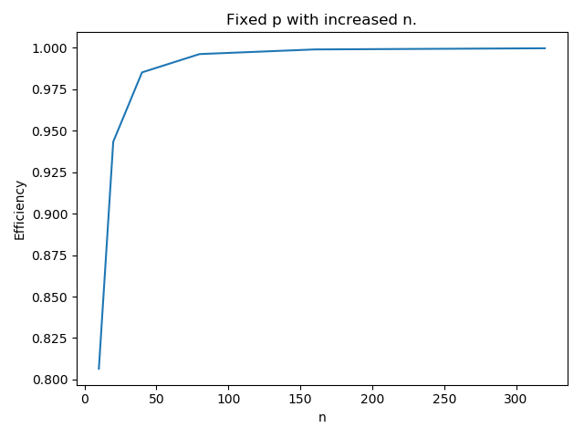

# Homework of Chapter 2

## Exercise 2.3

### Problem


### Answer

a) If the size of array increased, the program will run slower because of the increasing of cache miss rate caused by the lack of cached space. And  when cache increase at the same time, the program can run faster because of the decreasing of cache miss rate.

b) If MAX = 8 and the cache can store only four lines, the program will slow down due to many cache miss error.

c) Assuming that the cache can store four lines and MAX = 8, the first pair of nested loops will meet 16 cache misses. For each line at the matrix A, two misses will happen. And as for the second pair of nested loops, 32 cache misses will happened. Because for each line 4 misses will happen.

## Exercise 2.10

### Problem


### Answer

If we use 1000 processors to execute the task, each processor will execute $/frac{10^{12}}{10^3} = 10^9$ instructions during $10^9 / 10^6 = 10^3$ seconds. Define the time to send message is t, for each processor the overhead will be $999 * 10^9 * t$ (Suppose there is no other overhead).

a) The time of each processor will be $10^3 + 999 = 1999$ seconds.

b) The time will be $10^3 + 999 * 10^6 = 999001000$ seconds.

## Exercise 2.15

### Problem


### Answer

a) In the snooping cache coherence, all cores will be informed when the cache contains variables been updated. And in the write-back caches, the data in memory will not be updated immediately. Instead, the updated data in cache will be marked as dirty. When the cache line is replaced by a new memory cache line, the dirty line is written to memory. So the value of y will be 5, because when core 1 retrieve value of x, the dirty cache will be updated.

b) In the directory-based cache, only cores using a particular variable in their local memories will be contacted. So the value of y will be what was stored in memory at the time core 1 retrieve the variable x, since it was not using the variable x.

c) In the first part, all cores will be informed when the variable updated. It's no need to do so. And in the second part, data adventure will happened when two core use one variable at the same time. To solve the problems, we can store the data in memory with a history log. Each update will be logged. By this method, all core can read the log to decide which variable should be used.

## Exercise 2.16

### Problem


### Answer

___Code___

```python
import math
import matplotlib.pyplot as plt

n = 10
p = 8

ns = []
ts = []
for i in range(6):
    _n = n * pow(2, i)
    t_serial = _n * _n
    t_parallel = _n * _n / p + math.log2(p)
    ns.append(_n)
    ts.append(t_serial / (p * t_parallel))

plt.plot(ns, ts)
plt.xlabel('n')
plt.ylabel('Efficiency')
plt.title('Fixed p with increased n.')
plt.show()
plt.close()


n = 80

ns = []
ts = []
for i in range(8):
    p = pow(2, i)
    t_serial = n * n
    t_parallel = n * n / p + math.log2(p)
    ns.append(p)
    ts.append(t_serial / (p * t_parallel))

plt.plot(ns, ts)
plt.xlabel('p')
plt.ylabel('Efficiency')
plt.title('Fixed n with increased p.')
plt.show()

```




a) When n is fixed and p increases, the serial execution time is kept constant and the parallel execution time decreases more rapidly when the value of n is greater than p. When p is held fixed and n increases, the serial execution time grows and the parallel execution time increases.

b) If we check the efficiency function, at the time that $T_{overhead}$ grows more slowly than the $T_{serial}$, the efficiency of the parallel executing time will be changed due to the serial time . Thus, the parallel time would be practically limited by the serial time.

## Exercise 2.22

### Problem


### Answer

a) r = u + s

b) waiting_time = r - u - s

c) Sally cannot use Bob's function to determine whether MPI process is spending too much time waiting for messages. Because in Sally's system the waiting time has been calculated and included in user's time.